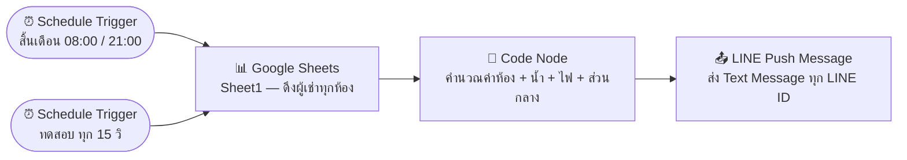
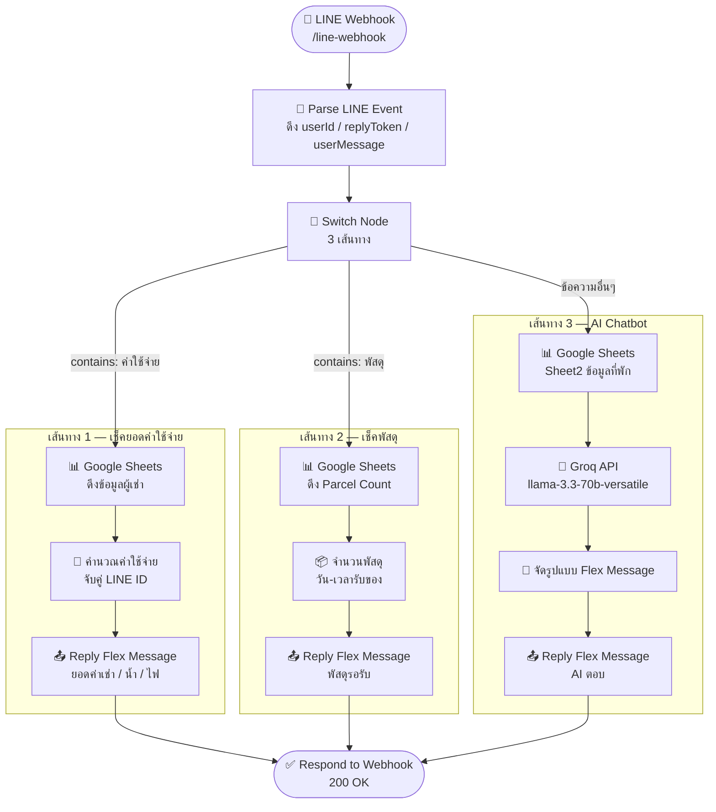
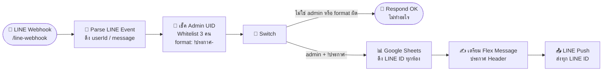

# 🏢 โฆษิตนิวาส (Khosit Niwat)
### ระบบแจ้งเตือนอพาร์ตเมนต์อัตโนมัติผ่าน LINE

> แจ้งค่าน้ำ ค่าไฟ ประกาศ และเหตุฉุกเฉินแบบอัตโนมัติ — ส่งตรงถึงผู้เช่าแต่ละห้องผ่าน LINE OA

---

## ภาพรวมระบบ

**โฆษิตนิวาส** คือระบบอัตโนมัติที่ช่วยให้เจ้าของและผู้ดูแลอพาร์ตเมนต์ไม่ต้องเสียเวลาแจ้งค่าใช้จ่ายและข่าวสารทีละห้องอีกต่อไป ระบบดึงข้อมูลจาก Google Sheets แล้วส่งข้อความแจ้งเตือนผ่าน LINE OA ตรงถึงผู้เช่าแต่ละรายโดยอัตโนมัติ

## ปัญหาที่แก้ไข

| ปัญหาเดิม | ทางออกของระบบ |
|---|---|
| พิมพ์ทักผู้เช่าทีละห้อง 1–3 ชั่วโมง/เดือน | ส่งข้อความอัตโนมัติพร้อมกันทุกห้อง |
| ปริ้นกระดาษติดบอร์ด ผู้เช่าอาจไม่เห็น | ส่งตรงถึง LINE ส่วนตัว |
| คำนวณค่าน้ำ ค่าไฟด้วยตัวเอง | คำนวณอัตโนมัติจากข้อมูลใน Google Sheets |
| ประกาศฉุกเฉินไม่ทั่วถึง | แจ้งเตือนทันทีผ่าน Webhook |
| ผู้เช่าต้องโทรถามข้อมูลทั่วไป | AI ตอบคำถามได้ตลอด 24 ชั่วโมง |
| ไม่รู้ว่ามีพัสดุรอรับ | แจ้งจำนวนพัสดุผ่าน LINE ได้ทันที |

---

## ⚙️ System Architecture & Workflow

ระบบนี้ทำงานแบบ Automation 100% ผ่าน n8n โดยรองรับทั้งการแจ้งหนี้, ประกาศฉุกเฉิน และการรับแจ้งปัญหาจากผู้เช่า

---

### ส่วนที่ 1 — แจ้งยอดรายเดือน (Schedule)

**การทำงาน:** ใช้ Schedule Trigger ตั้งเวลาทำงานอัตโนมัติทุกสิ้นเดือน เพื่อดึงข้อมูลเลขมิเตอร์น้ำ-ไฟจาก Google Sheets มาคำนวณผ่าน Code Node (JavaScript)

**ผลลัพธ์:** ส่งข้อความแจ้งยอดรวม (ค่าห้อง + ค่าน้ำ + ค่าไฟ) ไปยัง LINE ของผู้เช่าแต่ละห้องโดยตรงแบบรายบุคคล

---

### ส่วนที่ 2 — ตอบกลับอัตโนมัติ (Webhook)

**การทำงาน:** ทำงานผ่าน Webhook เพื่อรับข้อความจากผู้เช่า แล้วใช้ Switch Node แยกคำขอออกเป็น 3 เส้นทาง

**ผลลัพธ์:** ผู้เช่าสามารถเช็คข้อมูลส่วนตัวหรือสอบถามข้อมูลที่พักได้ตลอด 24 ชั่วโมง โดยระบบจะตอบกลับเป็น Flex Message ทันที

---

### ส่วนที่ 3 — Admin Broadcast (!ประกาศ-)

**การทำงาน:** ตรวจสอบสิทธิ์ (Whitelist) จาก LINE UID ของผู้ส่ง หากเป็นแอดมินและพิมพ์คำสั่งขึ้นต้นด้วย `!ประกาศ-` ระบบจะดึงรายชื่อ LINE ID ของผู้เช่าทั้งหมด

**ผลลัพธ์:** ทำการ Push Message แจ้งข่าวสารหรือเหตุฉุกเฉินให้ทราบพร้อมกันทุกห้องทันที

